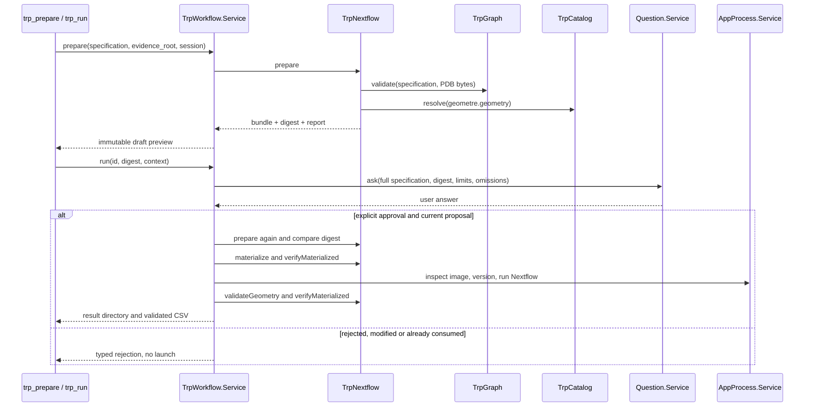

# F3: especificación, aprobación y composición

## Alcance ejecutable

La ruta `trp_catalog → trp_prepare → trp_run` está registrada en el agente. Genera dos procesos Nextflow para seleccionar una estructura PDB y calcular geometría con GeomeTRe. Las unidades son entradas explícitas. Los nodos de entrada son canales, no tareas de cómputo adicionales. Las herramientas se retiran al desactivar la especialización (`--bare`); `trp_run` requiere un cliente con preguntas habilitadas.

El validador acepta un grafo cerrado de cuatro nodos y tres aristas: `input.structure → pdb.select → geometre.geometry` e `input.units → geometre.geometry`. Rechaza otras topologías u operaciones. Es una implementación verificable sobre el catálogo admitido inicial; todavía no compone descubrimiento de repeticiones, conversiones SIFTS, modelos predichos ni ejecuciones en clúster.

## Entrada y salida

- **Entrada:** especificación JSON `trp-spec/1.0.0`, estructura local PDB, raíz de evidencias del catálogo y sesión del investigador.
- **Parámetros científicos:** intención, archivo/hash/identificador PDB, cadena de autor, ordinal del modelo, intervalos de unidades e inserciones. Cada grupo incluye origen declarado (`user`, `reference`, `derived`), referencia y descripción. La aprobación confirma el contenido; no autentica por sí misma la atribución de las fuentes.
- **Salida de preparación:** propuesta, digest SHA-256, hashes del paquete y comprobaciones aprobadas, fallidas u omitidas. No inicia procesos científicos.
- **Salida de ejecución:** código Nextflow, configuración, datos congelados, aprobación, validación, versiones, registros, traza y CSV comprobado. Un fallo conserva su registro; no produce un estado de éxito.

Ejemplo completo: [f3-reference-spec.json](../../evaluation/trp/development/f3-reference-spec.json). El catálogo actual se consulta para obtener su hash; una revisión del catálogo invalida las especificaciones anteriores.

## Algoritmo y correspondencia con código

| Paso | Acción                                                                                                             | Implementación                                                    |
| ---- | ------------------------------------------------------------------------------------------------------------------ | ----------------------------------------------------------------- |
| 1    | Decodificar JSON estricto; exigir revisiones, parámetros y sus fuentes                                             | `TrpSpecification.parse`, `TrpGraph.validate`                     |
| 2    | Comprobar nodos, dependencias, entradas requeridas y ausencia de ciclos                                            | `TrpGraph.validate`, recorrido de Kahn                            |
| 3    | Comprobar identidad, cadena, formato, numeración, inserciones, confianza y escala de cada arista y de las unidades | `TrpGraph.validate`, `TrpSpecification.contract`                  |
| 4    | Leer bytes, comprobar hash/HEADER y seleccionar modelo y cadena; verificar CA, intervalos y coordenadas            | `TrpGraph.validate`                                               |
| 5    | Resolver evidencia del catálogo y emitir adaptadores fijos con parámetros en JSON                                  | `TrpCatalog.resolve`, `TrpNextflow.prepare`                       |
| 6    | Calcular H = SHA256(JSON canónico de versión del motor y hashes de archivos)                                       | `TrpNextflow.bundleDigest`                                        |
| 7    | Presentar especificación completa, H, límites y omisiones; recibir respuesta humana                                | `TrpWorkflow.run`, `Question.Service.ask`                         |
| 8    | Revalidar sesión, vigencia, entradas, referencias y H; consumir la aprobación                                      | `TrpWorkflow.run`                                                 |
| 9    | Materializar y comprobar archivos, imagen y Nextflow 25.10.4; resolver configuración, recorrer con stub y ejecutar | `TrpNextflow.materialize`, `verifyMaterialized`, `AppProcess.run` |
| 10   | Comprobar CSV y paquete; guardar éxito o fallo                                                                     | `TrpNextflow.validateGeometry`, `TrpWorkflow.run`                 |

Pseudocódigo LaTeX: [fase3-algoritmo.tex](fase3-algoritmo.tex), con `algorithm` y `algpseudocode`.

## Invariantes y límites

La propuesta más reciente sustituye la anterior incluso si resulta inválida. La revisión se vincula a sesión, identificador y digest; no existe un argumento `approved` controlable por el modelo. Un permiso configurado como automático no sustituye la respuesta de `Question.Service`. Una revisión nueva cancela la propuesta anterior. Las aprobaciones residen en memoria durante esta secuencia; reiniciar el proceso requiere preparar y aprobar otra vez. El registro de aprobación se conserva con la ejecución.

Los textos libres, las fuentes y los parámetros permanecen en JSON. El emisor solo incorpora identificadores validados en sus plantillas; no acepta comandos generados por el modelo. Comprueba los archivos antes y después de ejecutar. Esta garantía corresponde a la ruta TRP: el agente general conserva shell y edición de archivos, por lo que no se afirma aislamiento frente a un usuario o proceso que altere deliberadamente el entorno durante una ejecución.

La estructura requiere PDB clásico, identidad en HEADER, cadena explícita y numeración de autor positiva. No se descartan silenciosamente códigos de inserción, conformaciones alternativas ni residuos solicitados sin CA. No se infiere un desplazamiento entre numeraciones. B-factor conserva unidades Ų; no se convierte en pLDDT. Las unidades deben tener al menos seis residuos, conforme a la ventana admitida del ejemplo de GeomeTRe. Los controles biológicos y de confianza de F5 se enumeran como omitidos.

Antes del análisis real se resuelve la configuración y se ejecutan dos tareas simuladas en un directorio separado; su marca impide tratarlas como resultados. Un fallo en estas comprobaciones impide iniciar las dos tareas reales. La configuración local limita cada tarea a dos CPU, 2 GB y tres minutos, sin red en el contenedor ni reintentos. Esto no reemplaza el inventario ni la admisión presupuestaria de F4. La imagen F3 añade `procps` al entorno científico de F2 para obtener la traza de Nextflow; su referencia directa conserva exactamente el CSV anterior.

Para V nodos, E aristas, B bytes y R posiciones cubiertas por intervalos, la validación cuesta O(V + E + B + R), con cuatro tipos de operación fijos. La memoria es O(V + E + B + R). La serialización canónica ordena las claves de cada objeto; añade O(Σ k log k). Estos costos no incluyen los algoritmos científicos ni la ejecución de Nextflow.

## Verificación y separación de evaluación

El corpus de desarrollo contiene 33 composiciones inválidas, tres por cada uno de once modos de fallo. Se añaden pruebas de datos, aprobación, suplantación de sesión, alteración de archivos y registro/ablación de herramientas. No es la reserva T-GRAPH y no estima la tasa poblacional de aceptación indebida.

La referencia real pasa por `trp_prepare` y `trp_run` con una respuesta sintética del controlador de pruebas a `Question.Service`. Se identifica explícitamente como prueba de ingeniería: no mide acuerdo humano, comprensión del lenguaje ni desempeño de OpenAI. El CSV se compara byte por byte con la referencia científica anterior.

Las plantillas usan procesos DSL2 y entradas de archivo según la [documentación oficial de Nextflow](https://docs.seqera.io/nextflow/process). Los límites y opciones de contenedor se contrastaron con el [constructor Docker de Nextflow 25.10.4](https://github.com/nextflow-io/nextflow/blob/v25.10.4/modules/nextflow/src/main/groovy/nextflow/container/DockerBuilder.groovy). Las pruebas ejecutadas con esa versión prevalecen sobre la documentación móvil.
