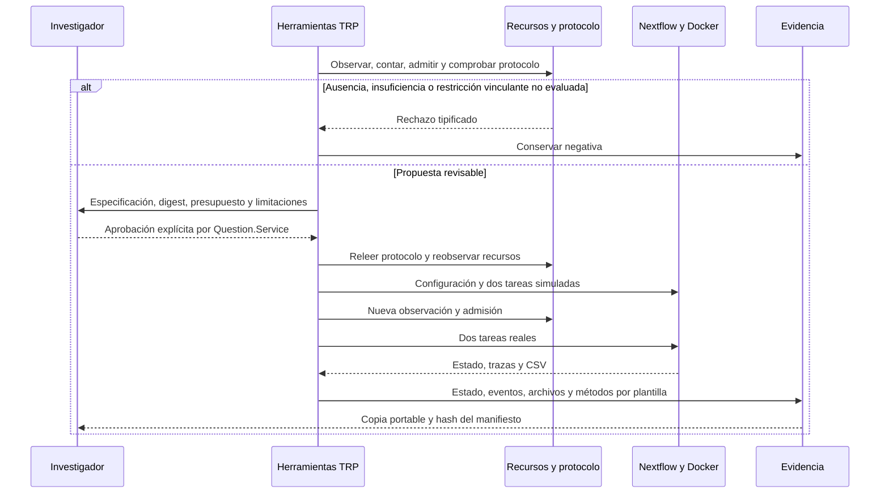

> Actualización de cierre: este informe conserva la referencia histórica F4. La cuota, los límites del controlador y el estimador posterior se documentan en [R3.2-RECURSOS.md](R3.2-RECURSOS.md), con sus resultados completos y límites de interpretación.

# F4: admisión y evidencia de la ruta TRP

Fecha: 15 de septiembre de 2026. Motor: `trp-nextflow/1.1.0`. Especificación científica: `trp-spec/1.0.0`. Catálogo: `trp-catalog/1.1.0`.

## Alcance alcanzado

`trp_prepare` exige un presupuesto explícito, observa recursos del anfitrión y rechaza ausencias o cantidades insuficientes. `trp_run` presenta presupuesto, cálculo, protocolo y especificación por el canal de aprobación. Reobserva recursos después de la respuesta y después del recorrido simulado, antes del análisis real. La aprobación protege el digest del conjunto preparado. El modelo no suministra un indicador de aprobación.

Los rechazos previos a preparar dejan `rejected-UUID.json`. Las propuestas preparadas tienen directorio propio y estado `prepared`; al invocar la ejecución se conservan también denegaciones, cancelaciones y fallos. No se interpreta una propuesta que nunca fue ejecutada como éxito. El servicio de protocolo existente sigue distinguiendo restricciones vinculantes y consultivas. Una restricción vinculante no evaluable bloquea esta ruta; cambiar el protocolo exige preparar otra propuesta.

## Inventario, conteo y límites

| Cantidad                     | Fuente y significado                                                                                                      |
| ---------------------------- | ------------------------------------------------------------------------------------------------------------------------- |
| CPU disponibles              | `os.availableParallelism`, observación del anfitrión                                                                      |
| Memoria disponible           | `/proc/meminfo:MemAvailable`, no memoria total                                                                            |
| Espacio libre                | `statfs.bavail × statfs.bsize` del directorio de trabajo                                                                  |
| Tareas                       | Dos simuladas + dos reales; los dos nodos de entrada son canales                                                          |
| Comandos del controlador     | Seis en una ejecución exitosa; argumentos, tiempos y resultado en `processes.jsonl`                                       |
| Llamadas científicas remotas | Cero en la ruta offline; no incluye conversación, tokens ni costo de OpenAI                                               |
| CPU/memoria reservadas       | 2 CPU y 2 GiB por tarea secuencial + reserva de 1 CPU y 2 GiB para controlador                                            |
| Tiempo configurado           | Dos watchdogs de ocho minutos y reserva de 120 segundos para consultas/configuración; no predicción del tiempo científico |
| Almacenamiento               | `64 × 1048576 + 4B + 4P`, con B = bytes UTF-8 de archivos iniciales y P = selección PDB                                   |

La fórmula de disco es una **estimación**, sin cuota agregada. Las cuotas/entitlements de cgroups, la exclusividad del anfitrión y la reserva efectiva del controlador no se observan ni garantizan. Pedir `requireHardStorageLimit=true` produce `storage-quota-unavailable`. La ruta restringe cada tarea con Docker, pero no atribuye esos límites al proceso completo. El socket local de Docker se comprueba antes de ejecutar; no se admiten endpoints remotos con inventario del anfitrión local. El espacio consumido por imágenes y distribuciones compartidas está fuera del directorio de trabajo y no se descarga automáticamente.

**R3.2 sigue parcial:** faltan cuota estricta, reserva efectiva y contraste del margen. No se declara alcanzado el umbral mediano ≤25% ni cero sobrepasos garantizados a partir de una referencia. F4 tiene su alcance inicial implementado; estas carencias permanecen dentro de la tesis antes de F6. El protocolo de evaluación F2 no se ha modificado.

## Algoritmo y correspondencia

1. Invalidar borrador anterior y validar datos y grafo (`TrpWorkflow.prepare`, `TrpNextflow.prepare`).
2. Observar inventario fechado (`TrpResources.observe`).
3. Contar tareas/bytes y comparar demanda, capacidad y presupuesto (`count`, `admit`); escribir negativa si corresponde.
4. Comprobar protocolo y guardar estado, libro y veredicto (`Protocol.guard`, `read`, `ledger`).
5. Incorporar inventario, presupuesto, decisiones y protocolo al digest (`bundleDigest`).
6. Registrar permiso y solicitar aprobación explícita (`ctx.ask`, `Question.Service.ask`).
7. Releer fuentes/protocolo, comparar digest y volver a admitir recursos (`TrpWorkflow.run`).
8. Consultar endpoint/imagen, versión y configuración; ejecutar recorrido simulado.
9. Volver a observar y admitir antes de las dos tareas reales; comprobar CSV y trazas.
10. Registrar estado, intervención y métodos; exportar copia completa (`TrpEvidence.methods`, `pack`).
11. Verificar una copia con Python estándar, opcionalmente contra un hash externo (`verify_bundle.py.txt`, publicado como `verify.py`).

La preparación y exportación recorren los bytes; ordenar claves y rutas añade su costo de ordenamiento. El número de tareas de esta ruta es constante. La verificación requiere O(bytes + archivos) más recorridos/ordenamientos de nombres; no ejecuta el algoritmo científico ni carga los objetos binarios serializados.



Pseudocódigo LaTeX: [fase4-algoritmo.tex](fase4-algoritmo.tex).

## Qué comprueba el paquete

Cada archivo del directorio de ejecución, incluidos trabajo, caché local y registros de Nextflow, se copia bajo `evidence/run/`. Los enlaces a archivos internos se convierten en bytes ordinarios; los externos, enlaces a directorios y archivos especiales impiden exportar. Se excluyen únicamente el propio directorio de exportación y recursos compartidos externos (imagen/distribución), declarados en el manifiesto. Verificar no exige esas instalaciones; reejecutar sí. Los archivos de caché son evidencia, no una promesa de reanudación portable.

`manifest.json` registra rutas relativas, tamaños, hashes y archivos del digest aprobado. `verify.py` comprueba cierre de archivos, datos, referencias del catálogo, enlaces de admisión y aprobación, eventos, tareas completadas y campos obligatorios de métodos. No ejecuta código contenido en la evidencia. El hash externo protege contra cambiar conjuntamente datos y manifiesto; por sí solos, los hashes no autentican autores ni aprueban biología.

Las intervenciones usan la instantánea de mensajes suministrada al entrar a la herramienta; no se afirma cobertura de toda una sesión. Se preservan por separado respuestas a preguntas de aprobación. Las reglas españolas/inglesas son heurísticas; sus ejemplos de desarrollo no son etiquetas externas, y `other` significa ausencia de señal reconocida. Anotación, kappa y cobertura independiente siguen pendientes en F6.

## Evidencia y comprobación

Referencia: `evaluation/trp/reference/nextflow-f4/engineering-reference.json`. La prueba pasa por las herramientas reales con un controlador de aprobación **sintético**, inventario observado y presupuesto local explícito. Reproduce el CSV de F2/F3: 12 unidades, SHA-256 `7e8393ba3d8cd1035b2e7b8a790fd896f3e8748038c52233e3ae4fc7aff41e0f`.

La copia final declara **121 archivos**. La auditoría detecta **250/250** fallos introducidos: 121 ausencias, 121 alteraciones, cinco rutas inseguras, un archivo adicional, un enlace externo y un ancla incorrecta. El paquete restaurado vuelve a pasar. Informe: `docs/tesis/evidencia/portable-audit-fase4.json`.

```bash
python3 evaluation/trp/reference/nextflow-f4/evidence/verify.py \
  evaluation/trp/reference/nextflow-f4/evidence \
  --sha256 1c1a81f55fdf9e3e1d33c0eb3ec045055169e1a738321a5c4bba2affacd71bb3
```

Las pruebas de dominio registran **472 correctas, una omitida por defecto y cero fallos**. La prueba real omitida se ejecutó por separado: una correcta. No hay mediciones de generalización, sensibilidad, kappa o desempeño de OpenAI. Anotador y clúster siguen sin confirmar; el modelo y presupuesto de evaluación también están pendientes.
