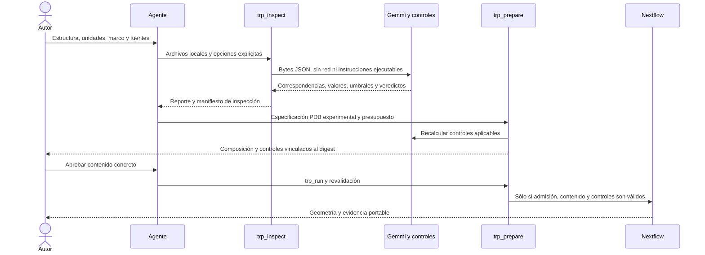

# F5: controles estructurales

## Resultado y alcance

Se implementan H5.1–H5.4 en el ámbito mecánico: catálogo, lectura semántica, controles y reporte por instancia. `trp_inspect` inspecciona mmCIF/PDB y PAE de AFDB; `trp_prepare` incorpora automáticamente los controles de la ruta experimental PDB al digest aprobado. El motor pasa a `trp-nextflow/1.2.0`.

**La validez biológica no queda establecida por pasar estos controles.** Los modos sin evidencia o método aplicable se conservan como `not_evaluable`. La ejecución de geometría sobre modelos predichos, SIFTS/UniProt, ampliación del catálogo y garantías estrictas de F4 siguen pendientes antes de F6. No se declara cerrada la cobertura del dominio completo.

### Qué falta exactamente en R3.2 de F4

| Componente  | Implementado                                              | Pendiente                                                                            |
| ----------- | --------------------------------------------------------- | ------------------------------------------------------------------------------------ |
| Tareas      | Dos simuladas y dos reales, sin reintentos                | Contraste reservado del corpus                                                       |
| Disco       | Estimación `64 MiB + 4B + 4P`; observaciones de capacidad | Cuota agregada de trabajo, registros, caché y exportación que detenga el crecimiento |
| Controlador | Se cuenta 1 CPU y 2 GiB adicionales a las tareas          | Reserva/límite efectivo de CPU y memoria del controlador de Nextflow                 |
| Margen      | Fórmula reproducible en frío                              | Medición del consumo máximo y de la sobreestimación mediana, objetivo ≤25%           |

Es **deuda de implementación y evaluación**, documentada en R3.2 y A.18 del Word. No falta una corrección del documento ni una respuesta del autor para programar esas garantías. El anotador y el clúster no bloquean su implementación local. La fase anterior limitó su alcance inicial; F5 avanza por indicación del usuario conservando esa deuda. Una solicitud de cuota estricta continúa produciendo `storage-quota-unavailable`.

## Inventario fijo inicial

El [catálogo ejecutable](../../packages/bioinformatica/src/trp/structural_catalog.json) conserva fuentes primarias y criterios. Hay nueve controles; todos emiten valor, umbral y motivo, aunque el valor sea nulo cuando el control no es evaluable.

| Control                   | Observable y criterio                                                                                   | Límite explícito                                                                                  |
| ------------------------- | ------------------------------------------------------------------------------------------------------- | ------------------------------------------------------------------------------------------------- |
| Escala                    | Método experimental o productor AF2 monómero + métrica local; B de Cα/local pLDDT con diferencia ≤0,011 | No inferir escala desde el rango numérico; NMR sin contrato de B no se admite                     |
| Filtro                    | Escala coherente; pLDDT `>=`, B experimental `<=`; umbral en dominio                                    | No aplica ni invierte filtros; 0–1 no se convierte implícitamente                                 |
| PAE entre unidades        | Entrada, modelo, versión, cadena, secuencia completa y ejes; matriz finita y cuadrada; ambos sentidos   | Perfil de ingeniería: mínimo pLDDT 70 y máximo PAE 5 Å; parametrizable, sin calibración reservada |
| Marco                     | Pares reales label/autor/inserción por modelo y cadena                                                  | Sin desplazamientos aritméticos ni alineación SIFTS/UniProt; ambiguos rechazados                  |
| Constructos               | Fuente sintética/diferencias y señal terminal de seis His en ventana de doce residuos                   | Señal de revisión, no verdad biológica; nunca recorta; otros casos no evaluables                  |
| Ensamblaje/anotación      | Datos genómicos y anotación independiente requeridos                                                    | Siempre no evaluable desde coordenadas aisladas                                                   |
| Límites de unidades       | Mismo hash/modelo/cadena/marco; cantidad y extremos frente a referencia declarada                       | Sin referencia independiente no evaluable; no autentica autoría/revisión                          |
| Cobertura                 | Cada posición solicitada con una Cα finita y única; unidades sin solapamiento                           | No desaparecen residuos o unidades silenciosamente                                                |
| Plausibilidad del pliegue | Evidencia física o experimental independiente                                                           | Siempre no evaluable con esta batería; PAE/pLDDT no detectan todos los fallos de Pratt            |

Fuentes: [AlphaFold DB](https://alphafold.ebi.ac.uk/faq), [pLDDT, formación de EMBL–EBI](https://www.ebi.ac.uk/training/online/courses/alphafold/inputs-and-outputs/evaluating-alphafolds-predicted-structures-using-confidence-scores/plddt-understanding-local-confidence/), [diccionario wwPDB](https://mmcif.wwpdb.org/dictionaries/mmcif_ma.dic/Items/_atom_site.auth_seq_id.html), [Tørresen et al.](https://doi.org/10.1093/nar/gkz841), [RepeatsDB 2.0](https://doi.org/10.1093/nar/gkw1136), [Pratt et al.](https://doi.org/10.1016/j.csbj.2025.01.016). Gemmi interpreta la sintaxis CIF; la [documentación de su parser](https://gemmi.readthedocs.io/en/stable/cif.html) distingue esa tarea de la interpretación de categorías.

## Algoritmo y correspondencia con implementación

El [algoritmo LaTeX](algoritmo-fase5.tex) formaliza el procedimiento. Su implementación está en `src/trp/inspect_structure.py.txt`, invocada por `structural.ts`. No implementa un nuevo predictor, detector de repeticiones, alineador ni clasificador físico.

1. `inspect`: verifica tamaño, formato, modelo, marco, intervalos y umbrales.
2. `cif_snapshot`: Gemmi 0.7.5 lee categorías; conserva identificadores como datos, sin evaluar contenido. `pdb_snapshot` mantiene la ruta heredada acotada de PDB.
3. `lookup`, `mapping`, `missing`, `ambiguous`: resuelven correspondencias sobre Cα observadas; conservan códigos y rechazan ambigüedad.
4. `checks`: registra cada control. PAE es asimétrica: para cada par de unidades disjuntas toma el máximo de cada bloque dirigido y conserva ambos.
5. `summary`: distingue `fail`, `not_evaluable` y `not_applicable`. `mechanicalAdmission` requiere cero fallos y evaluación suficiente de escala/filtro/PAE exigibles. `biologicalValidity` permanece `not_established`.
6. `inspectFiles`: guarda bytes originales, opciones, reporte, catálogo, programas y manifiesto. `nextflow.prepare`: añade reporte, catálogo y programa al digest para la ruta experimental, revalidada después de aprobar.

Para A observaciones, R posiciones solicitadas y PAE n×n, el costo dominante admisible es O(A+R+n²), con memoria del mismo orden. Los bloques entre unidades disjuntas no aumentan ese orden. Límites operativos: archivo ≤20 MB, solicitud JSON ≤40 MB, salida del parser ≤5 MB, 30 s; hasta 200 000 átomos mmCIF, 10 000 posiciones solicitadas y PAE de hasta 2 000 residuos. No equivalen a una cuota de memoria/disco; R3.2 sigue abierto.



La inspección no autoriza ejecución. En la referencia de ingeniería, un controlador de prueba proporciona la aprobación sintética y se identifica como tal. El proceso local de inspección es un precontrol adicional; las seis invocaciones ya registradas por F4 corresponden al controlador de ejecución, no al total de procesos del sistema.

## Datos reales y pruebas

- **2xqh/A:** misma entrada experimental del desarrollo anterior, ahora también mmCIF. Su correspondencia de autor/etiqueta se verifica sobre los registros y se prueba que reutilizar los números en el marco incorrecto pierde cobertura.
- **AF-P69905-F1 v6:** respuesta API, mmCIF y PAE archivados con SHA-256 y URLs. Hemoglobina, 142 residuos; dos intervalos artificiales prueban el mecanismo. **No es anotación de repeticiones ni control biológico de T-STRUCT.**
- **35 pruebas Python**: perturbaciones del productor, métricas, filtro, PAE, ejes, marcos, observaciones, constructo y límites, además de límites operativos y no evaluables.
- **Seis pruebas TypeScript**: aprobación vinculada, método ausente, modelo ordinal, cancelación, contención de rutas y herramienta del agente con verificación portable y corrupción por archivo.
- Referencia real Nextflow y suite de regresión: [evidencia F5](evidencia/fase5.json).

Las fuentes de desarrollo, sus perturbaciones y las familias ya reservadas como desarrollo quedan fuera de T-STRUCT. Los valores de diseño no se ajustan después de observar la reserva. Las metas del protocolo F2 no se modifican.

## Pratt: resultado de la auditoría de recuperación

El [reporte reproducible](../../evaluation/trp/reference/structural-f5/pratt/recoverability.json) registra 78 filas de predicciones de la tabla suplementaria. El paquete descargado incluye figuras, DOCX y XLSX; no contiene archivos de coordenadas o PAE, ni objetos incrustados de modelos en el DOCX. Se conservan artículo, suplementos y hashes. Esto describe el paquete recuperado; no afirma inexistencia de datos en poder de los autores.

**Cero modelos originales ejecutados; sensibilidad y especificidad nulas como dato ausente (`null`), no tasas de cero.** Las 78 filas no son 78 fallos confirmados. Obtener modelos originales y etiquetas sigue siendo una dependencia de F6. No se enviaron correos ni se produjeron predicciones sustitutas. PAE/pLDDT no se presentan como un método suficiente para los fallos físicos publicados.

## Uso y reproducción

Desde la raíz del repositorio:

```bash
uv venv .bioinformatica/trp-python
uv pip install --python .bioinformatica/trp-python/bin/python -r script/tesis/requirements-structural.txt
.bioinformatica/trp-python/bin/python script/tesis/test_structural_controls.py
.bioinformatica/trp-python/bin/python script/tesis/run_structural_reference.py
python3 script/tesis/audit_pratt_recoverability.py
python3 evaluation/trp/reference/structural-f5/inspection/verify.py evaluation/trp/reference/structural-f5/inspection --sha256 ee6eb300c57a13a1311f483e8b906bea6263868e34ed3cd00f11fc3c9a9e4a1c
```

`trp_inspect` usa primero `BIOINFORMATICA_TRP_PYTHON`, después el entorno local anterior y finalmente `python3`. La instalación se realizó localmente; el entorno no se incorpora a Git. No se descargan paquetes en una inspección. En otro equipo se reinstala desde la versión fijada. El verificador sólo necesita Python estándar; usa un ancla conservada por separado para detectar también un manifiesto reemplazado.

El informe no habilita por sí mismo geometría sobre modelos predichos. El control de constructos no está automatizado de forma completa, y los modos de ensamblaje y plausibilidad permanecen no evaluables. Por ello se registra F5 como implementación inicial verificada, con la ampliación y la evaluación pendientes; no se da por alcanzada la compuerta completa del dominio.
