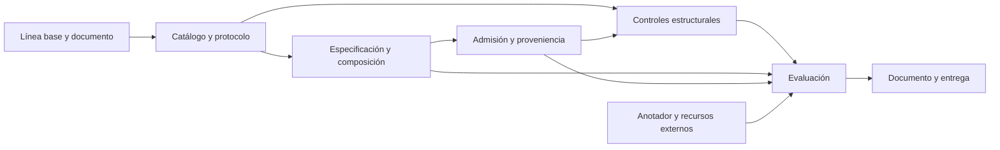

# Plan de cierre de la tesis y su implementación

Fecha de inicio: 15 de septiembre de 2026. Documento rector: `~/Projects/Tesis.docx`, leído con SHA-256 `c95fe37a10be7593be2eb2587d8805d7f72a37f0942395841098a796778a0341`. Código inicial: `f37ba272bcf0ae1b2700bf998c3a3495e4b0ba1f`.

## Alcance y regla de cierre

La tesis implementa Bioinformática.org sobre el armazón de agente heredado de opencode. El caso de estudio es el análisis de estructuras de proteínas de repeticiones en tándem (TRP). Se conservan los **cinco objetivos y 21 resultados** del Word vigente: OE1 (3), OE2 (6), OE3 (4), OE4 (4), OE5 (4). Los borradores históricos de nf-core y las listas anteriores de 13 o 19 resultados sirven de contexto; no sustituyen estos compromisos.

La pregunta operativa es si el agente transforma preguntas del dominio en especificaciones aprobadas, ejecuta composiciones compatibles y admisibles, y entrega evidencia comprobable de lo ejecutado y de los controles aplicados. Se evaluará cada indicador del §1.2.4, incluso si no alcanza su umbral. La proveniencia no demuestra corrección biológica. Pasar pruebas unitarias tampoco sustituye una evaluación experimental ni la anotación externa.

El cierre requiere: todos los apartados de la plantilla redactados, incluido el Anexo A; capítulo 4 **Presentación de los resultados esperados**; capítulo 5 **Conclusiones y trabajos futuros**; los 21 resultados enlazados con código, prueba, artefacto y limitación; evaluaciones reproducibles; bibliografía verificada; Word y PDF revisados visualmente. Un resultado no alcanzado se reporta con evidencia y consecuencias para el objetivo, sin presentarlo como logrado. Las dependencias externas pendientes impiden declarar cierre empírico o administrativo.

## Fases e hitos

| Fase                                 | Hitos ejecutables                                                                                                                                                                                                                                                     | Entregables y criterio de salida                                                                                                                                                                                                                                                | Dependencias                                                                                                                                                    |
| ------------------------------------ | --------------------------------------------------------------------------------------------------------------------------------------------------------------------------------------------------------------------------------------------------------------------- | ------------------------------------------------------------------------------------------------------------------------------------------------------------------------------------------------------------------------------------------------------------------------------- | --------------------------------------------------------------------------------------------------------------------------------------------------------------- |
| **F1. Línea base y estructura**      | H1.1 Inventariar los 21 resultados contra el código; H1.2 ejecutar pruebas de dominio; H1.3 corregir jerarquía y llenar secciones vacías con contenido de alcance y planificación; H1.4 incorporar comprobación independiente de corpus                               | Matriz completa; registro de pruebas; capítulos 4 y 5 correctamente numerados; resumen de trabajo; Anexo A completo como plan estimado; verificador sin Bun, modelo o red probado con alteraciones                                                                              | Ninguna. Es la primera fase de ejecución de esta sesión                                                                                                         |
| **F2. Catálogo y protocolo TRP**     | H2.1 Repetir auditoría de interfaces y licencias; H2.2 ejecutar una referencia de cada recurso admitido; H2.3 fijar contratos de entrada/salida e identificadores; H2.4 cerrar y versionar R2.1 antes de medir; H2.5 preparar encargo de anotación externa            | Catálogo declarativo con operaciones, términos EDAM/bio.tools verificados, espacios de identificadores, numeración y escalas; comandos, entradas/salidas y hashes; protocolo con corpus, exclusiones, denominadores, umbrales y reglas de reporte                               | F1. ReUPred requiere prueba técnica de instalación/ejecución y condiciones de uso verificadas. No sustituir una herramienta sin evaluar equivalencia            |
| **F3. Especificación y composición** | H3.1 Esquema de especificación y origen de cada parámetro; H3.2 aprobación ligada al hash de la especificación; H3.3 emisor Nextflow; H3.4 validador de grafo, identificadores, formatos y numeración; H3.5 informe de lo comprobado/omitido; H3.6 corpus adversarial | R1.2 y R2.2–R2.6 integrados en la ruta real del agente; ninguna ejecución sin aprobación y validación; flujo de referencia real; al menos 30 composiciones inválidas; pruebas de ciclos, pasos ausentes y mapeos incorrectos                                                    | F2, incluido catálogo admitido. Reutilizar `bio/sifts.ts`, `bio/glue.ts`, `nfcore/command.ts`, `nfcore/authoring.ts`                                            |
| **F4. Admisión y proveniencia**      | H4.1 Inventario explícito de recursos; H4.2 conteo y cotas con supuestos; H4.3 rechazo tipificado antes de ejecutar; H4.4 manifiesto de ejecución portable con hashes; H4.5 integrar permisos, admisión y protocolo; H4.6 métodos por plantilla                       | R3.1–R3.3 y R4.1–R4.4 implementados; comprobación desde copia del paquete, sin agente ni red; alteración/ausencia de artefactos detectada; cero aprobaciones tácitas al faltar inventario o validación                                                                          | F3. R4.3 sigue pendiente de acuerdo con anotador externo hasta F6. Reutilizar `environment/detect.ts`, `nfcore/{manifest,record,protocol,handcount,dossier}.ts` |
| **F5. Controles estructurales**      | H5.1 Catálogo de fallos y criterios mecánicos; H5.2 lectura semántica de mmCIF y metadatos de confianza; H5.3 controles de marcos, cobertura, escalas y correspondencia; H5.4 reporte por instancia                                                                   | R5.1–R5.3 integrados; cada negativo incluye valor y umbral; casos no evaluables separados de negativos; fixture real y caso adversarial por modo. Evaluar separadamente la capacidad de detectar los fallos publicados por Pratt et al.; PAE/pLDDT no se presuponen suficientes | F2 y F4. Fuentes primarias y datos recuperables, versionados y con licencia identificada                                                                        |
| **F6. Evaluación reproducible**      | H6.1 Congelar conjuntos y versiones; H6.2 evaluar al menos 50 enunciados y sus paráfrasis; H6.3 composición y admisión; H6.4 kappa externo; H6.5 sensibilidad/especificidad; H6.6 reproducir en entorno limpio                                                        | R1.3, R2.6, R3.4, R4.3 y R5.4 medidos con numeradores y denominadores, incertidumbre y fallos; logs crudos y comandos archivados; costos y tiempos medidos sin umbrales retrospectivos                                                                                          | F3–F5; anotador externo para R1.3/R4.3; presupuesto de API; clúster si se mantiene la ejecución en él. Pruebas técnicas previas no son el conjunto reservado    |
| **F7. Redacción y auditoría final**  | H7.1 Actualizar capítulos 1–3 contra el sistema final; H7.2 completar resultados por R; H7.3 conclusiones por OE; H7.4 verificar cada cita/figura; H7.5 sustituir notas resueltas; H7.6 actualizar índices, exportar PDF y revisar paginación                         | Documento completo sin instrucciones de plantilla; evidencia accesible desde cada cifra; anexos referenciados; build/tipos/pruebas pertinentes; guía de instalación y reproducción; paquete final identificado por commit y hash                                                | F6. Copia auténtica del Tema FCI y título oficial antes de entrega administrativa                                                                               |

## Diseño de la arquitectura restante

El modelo propone una especificación. Un esquema comprueba que esté completa y conserva el origen de cada parámetro. La aprobación se vincula al contenido aprobado: una modificación exige una aprobación nueva. El catálogo limita las operaciones componibles. El validador revisa todo el grafo; después, el contador de demanda decide la admisión contra el inventario declarado. Solo entonces el ejecutor inicia Nextflow. Cada transición escribe evidencia y cada negativa tiene un código estable. Los métodos se generan desde esos registros.

Ubicaciones propuestas para código nuevo, **todavía no construidas en F1**: `packages/bioinformatica/src/trp/{catalog,specification,composition,validation,admission,controls,methods}.ts`, pruebas en `test/trp/`, corpus pequeños de regresión en `test/fixture/trp/` y evaluaciones en `evaluation/trp/`. Mantener las capas del monorepo: contratos compartidos en Schema/Protocol cuando correspondan, lógica del dominio en el paquete y adaptadores del agente en `src/tool/`. Evitar duplicar los clientes biológicos y el sistema de permisos existentes.

## Protocolo de evaluación por cerrar en F2

- Conservar los umbrales del Word: admisibilidad y estabilidad ≥85%; emisión de flujos ≥95%; aceptación indebida ≤5%; kappa ≥0,70. Son metas, no resultados.
- Completar los umbrales que el documento deja abiertos (demanda/consumo, falso rechazo y sensibilidad) **antes** de evaluar. Explicar su fundamento y registrar una enmienda si cambian.
- Definir denominadores, particiones de desarrollo/reserva, tratamiento de casos no evaluables, agrupamiento de paráfrasis por intención y estructuras por familia. No dividir las paráfrasis de una misma intención entre desarrollo y reserva.
- No usar la falta de diferencia significativa como prueba de equivalencia. La comparación de ablación nf-core es una evaluación adicional histórica, no sustituye los 21 resultados TRP actuales.
- Una cota de tiempo mínimo impuesta por un servicio no es una cota superior del tiempo de ejecución. El tamaño de salidas desconocidas exige supuestos explícitos o un presupuesto conservador.
- Para medir falsos rechazos hacen falta ejecuciones de contraste en un entorno controlado y autorizado; sin ese contraste, registrar el caso como no evaluado.
- La cifra de pruebas automatizadas incluye pruebas de componentes existentes. No se reutiliza como porcentaje de éxito de la tesis.

## Plan del documento y figuras

| Parte                                | Trabajo de cierre                                                                                                                        | Evidencia o ilustración                                                                                                 |
| ------------------------------------ | ---------------------------------------------------------------------------------------------------------------------------------------- | ----------------------------------------------------------------------------------------------------------------------- |
| Portada, resumen, Tema FCI e índices | Título de trabajo marcado; resumen de 200–300 palabras actualizado al cierre; incorporar constancia auténtica; regenerar índices         | Documento oficial pendiente; no inventar aprobación                                                                     |
| Capítulo 1                           | Conservar OE1–OE5; llenar R2.1 en la tabla; acotar verificabilidad y consistencia de método/implementación                               | Árbol existente y tabla de trazabilidad                                                                                 |
| Capítulo 2                           | Comprobar definiciones, versiones y límites de escalas; revisar afirmaciones normativas contra fuentes oficiales                         | Figura propia de marcos de numeración y origen de confianza                                                             |
| Capítulo 3                           | Verificar búsqueda, deduplicación, extracción y referencias contra los datos originales; retirar afirmaciones universales no demostradas | Diagrama de selección con conteos calculados; tabla de comparación con criterios explícitos                             |
| Capítulo 4                           | Una sección por OE y una ficha por R: entregable, ruta, prueba, indicador observado y limitación                                         | Arquitectura propia, recorrido de un caso real, verificación y matrices de errores; figuras solo desde datos ejecutados |
| Capítulo 5                           | Conclusión vinculada a cada OE; alcance empírico y limitaciones; trabajo futuro separado                                                 | Referencias cruzadas a resultados positivos y negativos                                                                 |
| Anexo A                              | Justificación, viabilidad, alcance, limitaciones, riesgos, EDT, tareas, cronograma, recursos y costos                                    | Todas las subsecciones de la plantilla; estimaciones y disponibilidad identificadas                                     |
| Evidencia complementaria             | Catálogo, protocolo fechado, tablas completas y guía de reproducción                                                                     | Anexos B/C cuando existan; no anexar historial privado ni sesiones sin selección y revisión                             |

Las observaciones usan exactamente el patrón existente: **NOTA PARA EL AUTOR.**, cursiva y rojo `FF0000`. Corregir erratas resueltas y retirar su nota obsoleta. Las sugerencias de figuras de artículos incluyen verificar pie, fuente y permiso/licencia en F7; las propias declaran «Elaboración propia».

## Calendario y presupuesto de trabajo

Escenario de planificación pendiente de confirmación: 20 horas semanales del tesista, 600 horas de construcción/evaluación/redacción más 40 horas de reuniones y revisión, a S/25 por hora como costo de oportunidad supuesto. No representa un salario, una cotización ni gasto autorizado. Se reserva aproximadamente 20% de holgura en la duración: 38 semanas desde septiembre de 2026, con entrega interna en junio de 2027 y margen previo a la sustentación de julio de 2027 mencionada en el contexto.

| Fase                             | Horas del tesista |      Duración estimada a 20 h/semana | Ventana programada                | Costo humano supuesto |
| -------------------------------- | ----------------: | -----------------------------------: | --------------------------------- | --------------------: |
| F1                               |                40 |                            2 semanas | 15 sep–2 oct 2026 (18 días)       |               S/1 000 |
| F2                               |                80 |                            4 semanas | 5 oct–6 nov 2026 (33 días)        |               S/2 000 |
| F3                               |               120 |                            6 semanas | 9 nov 2026–1 ene 2027 (54 días)   |               S/3 000 |
| F4                               |               100 |                            5 semanas | 4 ene–12 feb 2027 (40 días)       |               S/2 500 |
| F5                               |               100 |                            5 semanas | 15 feb–26 mar 2027 (40 días)      |               S/2 500 |
| F6                               |               100 |                            5 semanas | 29 mar–7 may 2027 (40 días)       |               S/2 500 |
| F7                               |                60 |                            3 semanas | 10 may–4 jun 2027 (26 días)       |               S/1 500 |
| Reuniones y revisión transversal |                40 | 2 semanas equivalentes, distribuidas | 15 sep 2026–4 jun 2027            |               S/1 000 |
| **Total**                        |           **640** |          **32 semanas equivalentes** | **263 días naturales inclusivos** |          **S/16 000** |

El calendario son ventanas propuestas, no duración observada de esta sesión ni compromiso institucional. La capacidad semanal reservada durante todo el intervalo cubre las reuniones; las vacaciones y el calendario de los cursos deben ajustarse antes de congelarlo. El presupuesto detallado y su reserva están en el Anexo A. Ninguna cifra de presupuesto se usa como resultado experimental.

## Dependencias y decisiones que requieren contexto externo

El usuario confirmó durante esta sesión que el agente ya está conectado con OpenAI. Se considera resuelto el acceso configurado, sin exponer credenciales ni asumir una prueba de ejecución que no se realizó en F1. Antes de la campaña se fijarán el modelo exacto, sus opciones y el presupuesto; no se pedirá conectar de nuevo el proveedor.

| Dependencia                              | Impacto                                                       | Acción preparada / criterio                                                                                                                     |
| ---------------------------------------- | ------------------------------------------------------------- | ----------------------------------------------------------------------------------------------------------------------------------------------- |
| Título aprobado y Tema FCI               | Cierre de portada y sección administrativa                    | Usar título de trabajo marcado; incorporar el documento auténtico cuando esté disponible                                                        |
| Anotador ajeno al desarrollo             | R1.3 y R4.3                                                   | Preparar guía y corpus; no inventar juicios externos ni reportar kappa de autoetiquetas como validación independiente                           |
| ReUPred y otras herramientas del dominio | Catálogo y cadena de análisis                                 | Verificar interfaz/versión/ejecución/licencia; declarar recursos web como comparadores. No tratar auditoría de septiembre como ejecución actual |
| Clúster                                  | Afirmación metodológica de ejecución en agrupación de cómputo | Ejecutar localmente mientras se concreta acceso; distinguir configuración preparada de ejecución demostrada                                     |
| API/cómputo                              | Evaluación del modelo                                         | Preparar corpus y runner offline; concretar modelo, presupuesto y límites antes de campaña con costo                                            |
| Datos de fallos publicados               | Sensibilidad de OE5                                           | Recuperar originales y conservar hashes/condiciones; un caso sintético no reemplaza silenciosamente el caso publicado                           |

No se necesita volver a pedir autorización para editar los archivos o hacer commits: el usuario ya la dio. La escritura del Word fuera del área de trabajo puede requerir permiso técnico del sandbox. No se envían correos, se contratan servicios ni se publican cambios por inferencia.

## Estado y continuación

Consultar [ESTADO.md](ESTADO.md) y [trazabilidad.json](trazabilidad.json). Cada fase registra comandos, resultados, artefactos y lo que falta. Los commits tienen exclusivamente un título en inglés, sin cuerpo ni firma de coautor. El cambio previo del usuario en `packages/sdk/js/src/v2/client.ts` queda fuera de ellos.
